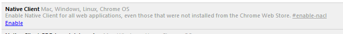

Osoasso
=======

Summary
-------
Osoasso is an experimental project to perform vector-based math operations in a web browser.  It uses the Google [Native Client] (http://gonacl.com) runtime in Google Chrome.

It is currently running [here](http://osoasso.appspot.com).

To use Osoasso, you must enable Native Client for all web applications, even those not installed from the Chrome web store. To do so, visit chrome://flags in Chrome and enable this option:



Once Native Client is enabled, type the `help` command, and the following output should be visible:

```
> help
Osoasso Version 11
For a list of commands, type this: help commands
```

Architecture
------------

* Most of the code is written in C++ and compiled with the NaCl GCC compiler
* The front end is written in Java using GWT

Goals
-----

* Perform expensive calculations in the browser using all available cores
* Store a history of all commands and the output of each command
* Support stateless commands to perform mathematical operations
* Persist the output of all commands
* Allow collaboration between mutliple users

Future Work
-----------
Ideas for future work are organized in Trello [here](https://trello.com/board/osoasso/4e70893763220bbc4b004586).

License
-------
This software is provided under the [MIT License](http://www.opensource.org/licenses/mit-license.php).
